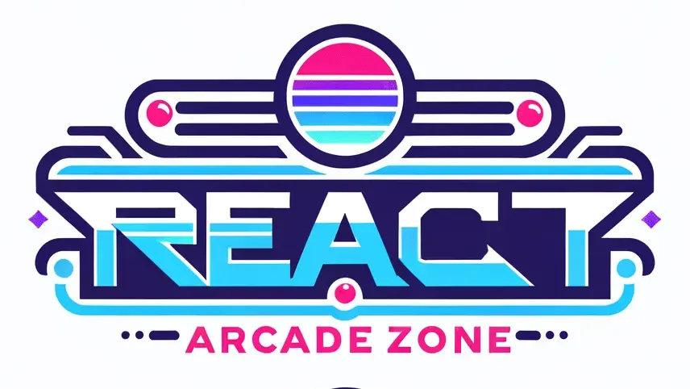

# *React Arcade Zone*
This project is for using react's best practices on games to have fun and showcasing the skills.



This is a [Next.js](https://nextjs.org/) project bootstrapped with [`create-next-app`]
## Getting Started

To run project locally, firstly:

```bash
npm run dev
# or
yarn dev
# or
pnpm dev
# or
bun dev
```

The, open [http://localhost:3000](http://localhost:3000) with your browser to see the result.

## Games

**Avaliable:**
- Hex Guess


**Coming Soon...**
- Balloon Pop
- Pair Match
- Snake Game
- Tic Tac Toe (3x3)
- Tic Tac Toe (9x9)
- Quiz game
- Hangman
- Wordle (newer)
- Sudoku
- Whack-a-Mole
- MineSweeper
- Ping Pong
- Aliens Invasion
- Secret Game (keepass)