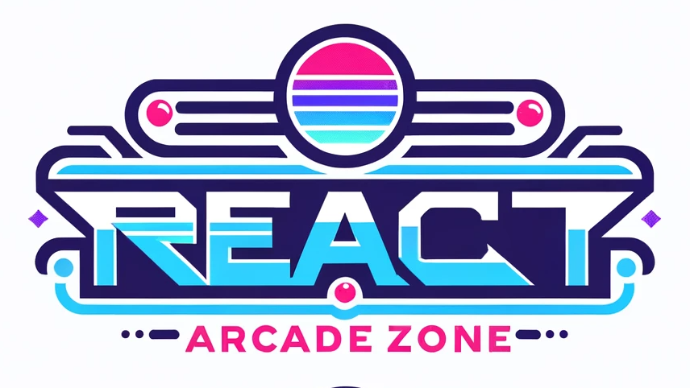

# <i>> React Arcade Zone</i>
This project is for using react's best practices on games to have fun and showcasing the skills.



This is a [Next.js](https://nextjs.org/) project bootstrapped with [`create-next-app`]
## Getting Started

To run project locally, firstly:

```bash
npm run dev
# or
yarn dev
# or
pnpm dev
# or
bun dev
```

The, open [http://localhost:3000](http://localhost:3000) with your browser to see the result.

